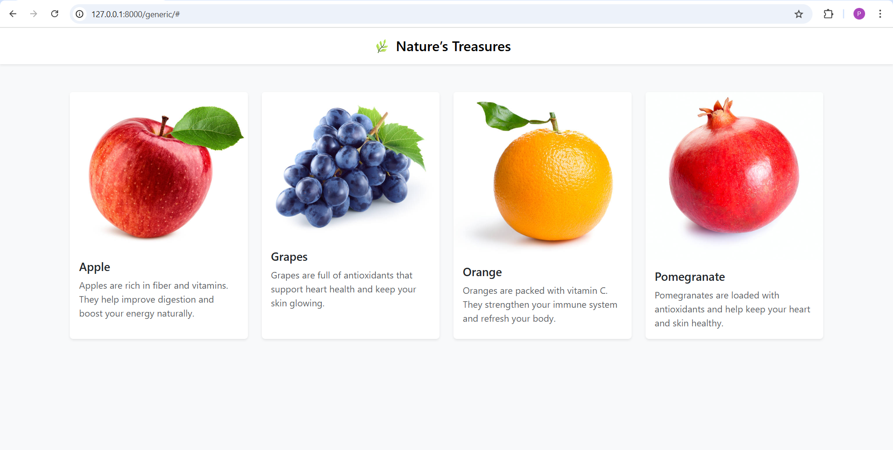

# Django Project with Generic Static Folder (Project-Level)
This project keeps all CSS, JavaScript, and images in one folder so they can be easily used in any app or template.
## Tech Stack
- Django
- HTML / CSS
- Bootstrap 5
## Screenshot

